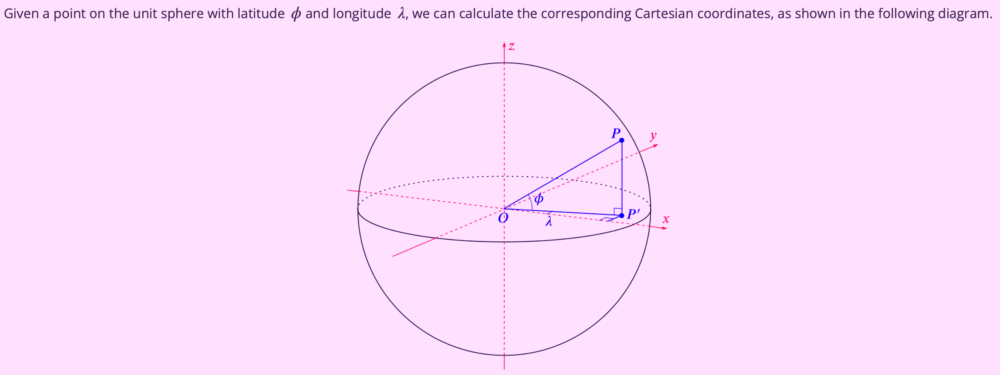
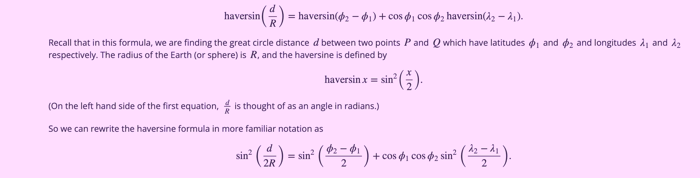

# Distance


This Rust program defines a `Coordinates` struct to represent geographical coordinates (latitude and longitude) and implements methods to calculate the great-circle distance between two points on the Earth's surface using the Haversine formula.

## Installation

1. Install Rust:\
   Instructions for the installation process can be found here -> https://www.rust-lang.org/tools/install

2. Clone the repository:

   ```bash
   git clone https://github.com/tpreisig/distance-between.git
   ```

3. Navigate to the project directory:

   ```bash
   cd distance-between
   ```

4. Run the executables:

   ```bash
   cargo run --bin city_distance
   cargo run --bin distance
   ```

## License

This project is licensed under the MIT License - see the [LICENSE](LICENSE) file for details.

## Explanations & Visuals

```bash
fn haversine_distance(lat1: f64, lon1: f64, lat2: f64, lon2: f64) -> f64 {
    let earth_radius = 6371.0;
    let dlat = (lat2 - lat1).to_radians();
    let dlon = (lon2 - lon1).to_radians();
    let a = (dlat / 2.0).sin().powi(2)
        + lat1.to_radians().cos() * lat2.to_radians().cos() * (dlon / 2.0).sin().powi(2);
    let c = 2.0 * a.sqrt().atan2((1.0 - a).sqrt());
    earth_radius * c
}
```

`to_radians()` converts degrees to radians because trigonometric functions in Rust's std expect angles in radians.

`a` represents the haversine of the central angle between the two points:
(lat_diff / 2.0).sin().powi(2): This is the square of the sine of half the difference in latitude.

`self.latitude.to_radians().cos() * other.latitude.to_radians().cos() * (long_diff / 2.0).sin().powi(2)`\
This part accounts for the longitude difference but adjusted by the cosine of latitudes because the Earth is not flat; the distance between lines of longitude decreases as you move towards the poles.

The formula `hav(θ) = sin²(θ/2)` where θ is an angle, is used here for a. It's particularly useful for computing distances because it avoids the numerical instability near zero in other formulas.

`c` is the central angle between the two points in radians. The formula c = 2 * atan2(sqrt(a), sqrt(1-a)) converts from haversine back to the angle itself.

`atan2` is used instead of atan for better numerical stability when dealing with very small or very large angles.

And eventually multiply `c` by Earth's mean radius (6371 km) to get the distance in kilometers.
That's it.




## Contact

Maintained by tpreisig - feel free to reach out!
